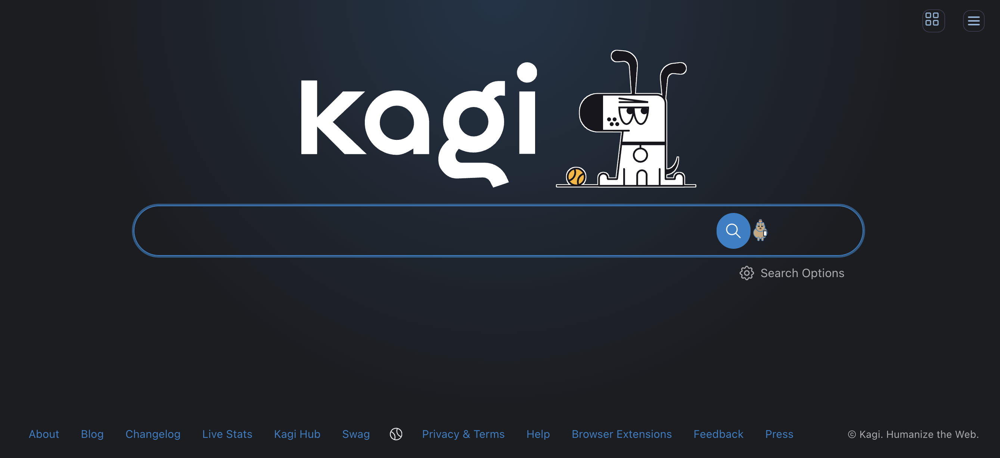
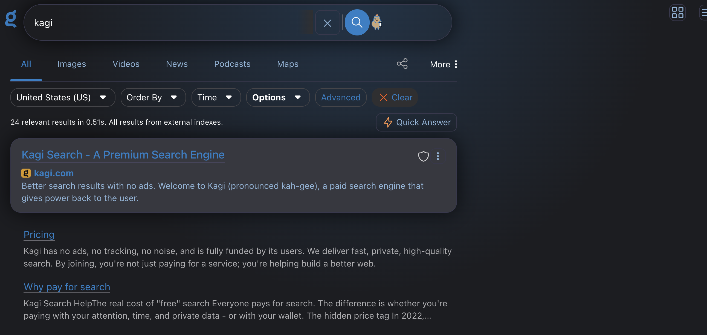

# kagi_capy_ui
Capy UI Theme for Kagi Search

This is a port of Mastodon Capy UI (Single Column CSS) for Kagi Search Custom CSS.

Currently requires Dark Mode enabled in Kagi.  Will expand it to not require that in future.

## Screenshots

### Search Page

### Search Results

## Features
- **Dark theme** with Tricorn Black background and Electric Blue accents
- **Gradient background** with subtle blue radial gradient
- **Capybara mascot** logo positioned inside the search field
- **Rounded UI elements** (16px/32px border radius)
- **Responsive design** optimized for both desktop and mobile

## Recent Fixes (Dec 2025)
- ✅ Fixed capy logo positioning to be inside the search bar (was overlapping at `right: -48px`)
- ✅ Adjusted mobile capy logo size and position for better text visibility
- ✅ Added proper padding to search input to prevent text from being cut off by icons
- ✅ Fixed magnifier icon positioning on both mobile and desktop
- ✅ Ensured all icons stay within the search container boundaries

## Installation
1. Go to Kagi Settings → Appearance → Custom CSS
2. Copy the contents of `Capy_UI.css`
3. Paste into the Custom CSS field
4. Save and enjoy!

## Notes
- The gradient background may be ported back to the Mastodon version in the future
- Originally based on [Mastodon Capy UI](https://github.com/ppb1701/mastodon-capy-ui)